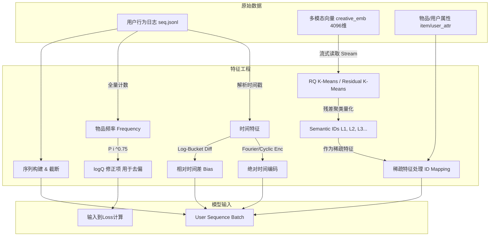
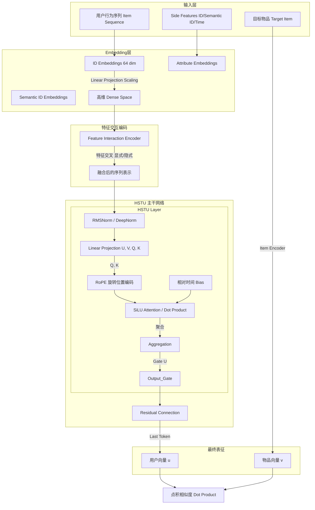
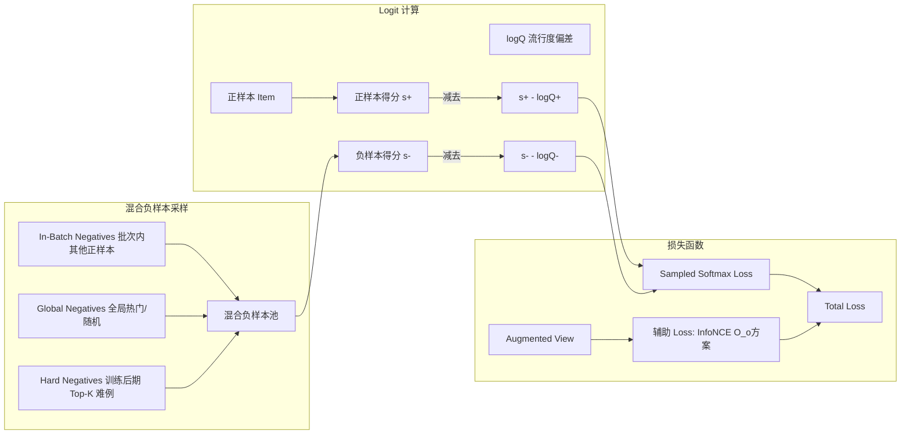

# 腾讯广告算法大赛2025 冠军方案策略分析

作为推荐算法领域的专家，针对2025年腾讯广告算法大赛的冠军方案，由于各队均取得了优异成绩，其策略在模型架构、训练目标、特征工程及工程优化等方面展现出了高度的共识与创新。如果面试官问及此次比赛的冠军方案策略，我会从以下几个核心维度进行阐述：

## 1. 核心模型架构：HSTU的全面确立
三套冠军方案（包括代码中体现的 `O_o` 方案）不约而同地采用了 **HSTU (Hierarchical Sequential Transduction Unit)** 或其变体作为序列建模的主干网络。
- **优势**: 相比传统Transformer，HSTU在处理长序列时具有更高的计算效率和更强的捕捉用户长期兴趣的能力，特别是在工业级大规模数据上表现优异。
- **细节**:
    - 普遍使用了 **RoPE (Rotary Positional Embedding)** 旋转位置编码，增强位置信息的表达。
    - 引入 **DeepNorm** 或 **RMSNorm** 提升训练稳定性。
    - **SiLU** 激活函数替代传统的Softmax Attention（部分方案），降低计算复杂度并保留梯度。

## 2. 训练目标与负样本采样：去偏与挖掘
冠军方案在损失函数设计上非常精细，核心在于解决大规模分类中的计算效率与偏差问题。
- **Sampled Softmax & Importance Sampling Correction**:
    - 针对全量Item Softmax计算量大的问题，采用采样Softmax。
    - 关键在于引入 **$\log q$ 修正**（$q$为物品频率），即 Importance Sampling Correction，以消除热门物品被过度采样带来的偏差，实现无偏估计。
- **混合负样本策略**:
    - **In-batch Negatives**: 利用Batch内其他样本作为负样本，高效且能利用GPU矩阵运算。
    - **Global Negatives**: 维护全局活跃物品池，随机采样，防止模型对Batch内热点过拟合。
    - **Hard Negative Mining (难负样本挖掘)**: 随着训练进行，逐步增加Top-k难负样本的比例（Curriculum Learning），迫使模型区分难以分辨的物品。
- **对比学习 (InfoNCE)**:
    - 部分方案引入对比学习，通过数据增强（Reorder, Mask）生成正样本对，利用InfoNCE Loss拉近同一用户不同增强序列的表征，增强鲁棒性。

## 3. 特征工程：时间与多模态的深度利用
本次比赛中，时间特征和多模态特征的处理是提分的关键胜负手。
- **精细化的时间建模**:
    - **周期性编码**: 对Hour, Weekday进行Sin/Cos循环编码或Embedding，并将其转化为UTC+8时间。
    - **相对时间偏差 (Relative Attention Bias, RAB)**: 在Attention层引入基于时间差（$\log$-bucketed time difference）的Bias，让模型显式感知行为的时间间隔。
    - **绝对时间编码**: 采用Fourier Encoding处理绝对时间戳。
- **多模态特征 (RQ K-Means / Residual K-Means)**:
    - `O_o` 等方案采用了 **RQ K-Means (残差聚类)** 而非传统的 RQ-VAE 来生成 **Semantic ID**。
    - **原理**: 这是一种流式残差聚类技术，通过多层 Codebook 对高维多模态 Embedding 进行逐层量化，将 4096 维的稠密向量转化为层次化的离散 ID。
    - **优势**: 相比需要神经网络训练的 VAE，RQ K-Means 在处理千万级数据时更稳定、更易于并行化，且能有效避免 VAE 常见的表征坍塌问题。这种“语义 ID 化”的处理方式，使得模型能以极低的计算开销（Embedding Look-up）引入极其丰富的语义信息。
- **特征降维与Scaling**:
    - 针对高基数低频特征（如长尾ID），采用 **Hash分桶** 或 **Top-K截断**，并在Embedding层与主干网络间解耦维度（如Emb=64, Hidden=512），在显存有限的情况下最大化模型容量。

## 4. 工程优化与训练策略
- **两阶段/多阶段训练**: 先用简单负样本快速收敛，再加入Hard Negative微调。
- **Cosine Annealing**: 学习率余弦退火策略，配合较长的Warmup，帮助模型跳出局部最优。
- **全链路优化**: 移除Faiss库依赖，直接使用Torch进行GPU加速的相似度计算；多进程数据加载优化IO瓶颈；支持断点续训。

## 方案核心 Pipeline 流程图

为了更直观地理解冠军方案的实现，以下从数据流、模型架构和训练策略三个维度进行展示：

### 1. 数据与特征工程 Pipeline
核心亮点在于 **RQ K-Means** 对高维多模态特征的离散化处理，以及全局 **logQ** 统计信息的生成。

### 2. 模型架构 Pipeline (HSTU Backbone)
冠军方案的主干网络，通过 **HSTU** 和 **RoPE** 高效捕捉长序列语义。

### 3. 训练与采样策略 Pipeline
通过 **Importance Sampling Correction** 和 **混合采样** 解决大规模推荐的去偏与效率问题。

## 总结
综上所述，本次比赛的冠军方案策略可以概括为：以 **HSTU** 为骨架，**去偏采样Softmax** 与 **难例挖掘** 为灵魂，深度融合 **时序/多模态特征**，并辅以 **RQ K-Means** 等高效表征量化技术。这种组合在保证大规模工业级数据处理效率的同时，最大化了推荐的准确性。

## 附录：各类特征的详细处理方式

如果面试官进一步追问每类特征的具体处理细节，可以补充以下内容：

### 1. ID类特征 (User/Item IDs)
- **参数解耦与Scaling**: 为了在显存受限（如单卡）的情况下容纳千万级ID，冠军方案普遍将Embedding层与模型Hidden Size解耦。例如，Embedding维度设为64，而模型主干Hidden Size设为512或1024。
- **长尾处理**:
    - **Top-K保留**: 对高基数特征（如Seller ID），只为出现频率最高的Top-K构建独立Embedding。
    - **Hash分桶**: 剩余的长尾ID映射到固定数量的Hash桶中，共享Embedding，以此平衡参数量与覆盖率。
    - **MoRec尝试**: 部分方案尝试了无ID模式（Pure ID-free / MoRec），即完全移除User/Item ID Embedding，仅依靠多模态和Side Features建模，以增强模型的泛化能力（虽然最终融合方案通常还是保留了ID）。

### 2. 稀疏类别特征 (Sparse/Categorical Features)
- **基础处理**: 采用标准的 `Embedding Lookup`。
- **时间特征的特殊处理**:
    - **周期性编码**: 对 `Hour` (0-23) 和 `Weekday` (0-6) 不仅使用Embedding，还配合 Sin/Cos 编码注入模型，保留时间的周期性语义。
    - **交叉特征 (Feature Crossing)**: 手工构建强先验的交叉特征，例如 `Week_Hour` 组合，显式捕获“周五晚上”这种特定的时间模式。
- **动作类型 (Action Type)**: 将用户的行为类型（点击、购买等）作为独立特征输入，有时也作为预测目标（Multi-task Learning）。

### 3. 数值/连续特征 (Continual/Numerical Features)
- **归一化与对齐**:
    - 对连续值进行 `Log1p` 或 `Z-Score` 归一化。
    - 通过 `Unsqueeze` 操作将标量对齐到 Embedding 维度（如 1 -> D），直接参与运算或通过一个 `Linear` 层映射。
- **时间差特征**: 将行为序列中的时间间隔（Time Delta）进行 **Log-Bucket** 分桶，转化为类别特征或作为 Attention 的 Bias (Relative Time Bias)，让模型感知“刚刚”和“很久以前”的区别。

### 4. 序列/数组特征 (Array Features)
- **多值特征聚合**: 对于 `User/Item Array` 特征（如用户历史所属的一组标签），通常先分别 Lookup 得到 Embedding 列表，然后采用 `Sum Pooling` 或 `Mean Pooling` 聚合为一个向量。
- **序列增强**: 在训练中对历史行为序列进行 **Random Mask** (随机掩码) 或 **Reorder** (随机重排) 作为数据增强手段，提升模型鲁棒性。

### 5. 多模态特征 (Multimodal Features)
这是本次比赛的重中之重，处理方式最为精细：
- **原始向量降维**: 提供的原始多模态向量维度高达 4096 维。
    - **方案一 (Projector)**: 使用 `Linear` 层降维（如 4096 -> 64）。
    - **方案二 (RQ K-Means)**: **(关键策略)** 使用残差聚类将高维向量量化为 3~4 层离散的 Semantic ID（如 `sid_l1`, `sid_l2`...），然后像处理普通 ID 一样进行 Embedding Lookup。这种方法不仅大幅降低了显存占用（存储 int 索引 vs float 向量），还引入了极其丰富的语义聚类信息。

