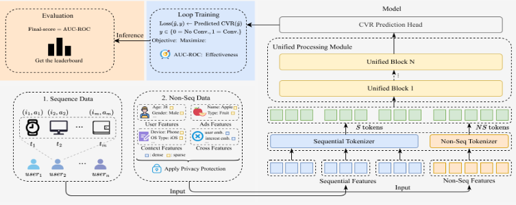

The dataset released in this competition is fully anonymized and does not reflect the exact production characteristics of Tencent’s advertising platform.

Our dataset is a large-scale industrial dataset constructed from real-world advertising logs. It consists of two main components: (1) user behavior sequences and (2) non-sequential multi-field features.

User behavior sequences contain interaction events between users and items (e.g., exposure, click, conversion), each associated with side information such as timestamps and action types. Multi-field features include user attributes, item attributes, contextual signals, and cross features.

To ensure fairness and protect privacy, all sparse features are represented as anonymized integer IDs, and dense features are provided as fixed-length float vectors. No raw content (e.g., text, image, URL) or personally identifiable information is released.

The preliminary round dataset contains 200 million user sequences, and uses a flat column layout, where all features are stored as individual top-level columns instead of nested structs/arrays. Here is a detailed explanation of the dataset schema, including the column categories, data types, and descriptions:

Columns
The 120 columns fall into 6 categories:

Category	Count	Dateset	Description
ID & Label	5	int64 / int32	Core identifiers, label, and timestamp.
User Int Features	46	int64 / list<int64>	Discrete user features, including both single-value scalar features (such as age, gender, etc.) and multi-value array features (like marital status, etc.), describing user basic attributes and preferences.
User Dense Features	10	list<float>	Continuous-valued user features, including embeddings and other aligned signals for some corresponding integer features.
Item Int Features	14	int64 / list<int64>	Discrete item features, including item categories, types, and other basic information, as well as multi-label information for items.
Domain Sequence Features	45	list<int64>	Behavioral sequence features from 4 domains.
Detailed Column Schema
ID & Label Columns (5 columns)
All these 5 columns have no null value.

Column	user_id	item_id	label_type	label_time	timestamp
Date Type	int64	int64	int32	int64	int64
User Int Features (46 columns)
user_int_feats_{1, 3, 4, 48-59, 82, 86, 92-109}: Scalar int64, total 35 columns.
user_int_feats_{15, 60, 62-66, 80, 89-91}: Array list<int64>, total 11 columns.
User Dense Features (10 columns)
user_dense_feats_{61, 87}: Array list<float>, total 2 columns, representing user embedding features (SUM , LMF4Ads).
user_dense_feats_{62-66, 89-91}: Array list<float>, total 8 columns, corresponding to the integer features user_int_feats_{62-66, 89-91}, with the same length.
An Example:
user_int_feats_62: [1, 2, 3], user_dense_feats_62: [10.5, 20, 15.5]
Explanation: Here, the two arrays are aligned element by element. For example, the 1st element in user_int_feats_62 (value 1) denotes a specific entity or category, while the 1st element in user_dense_feats_62 (value 10.5) provides some statistics for that element, such as a dwell time, a score/probability.

Item Int Features (14 columns)
item_int_feats_{5-10, 12-13, 16, 81, 83-85}: Scalar int64, total 13 columns.
item_int_feats_{11}: Array list<int64>, total 1 column.
Domain Sequence Features (45 columns)
list<int64> sequences from 4 behavioral domains:

domain_a_seq_{38-46}: 9 columns
domain_b_seq_{67-79, 88}: 14 columns
domain_c_seq_{27-37, 47}: 12 columns
domain_d_seq_{17-26}: 10 columns
Evaluation
We will rank all teams using a single AUC of ROC metric (higher is better). To ensure practicality, each submission must also satisfy a track- and round-specific inference latency limit under the official evaluation environment and protocol; submissions that exceed the latency budget will be invalid and therefore not ranked, regardless of AUC.

To encourage innovation aligned with our theme—building a unified block that bridges sequence modeling and multi-field feature interaction, and exploring the scaling law of recommendation—we will additionally offer two innovation awards: the Unified Block Innovation Award ($45,000) and the Scaling Law Innovation Award ($45,000). These awards are independent of leaderboard ranking. Final award decisions will be made by the committee based on a holistic review of the submitted technical reports, code, and the novelty and insights of the proposed methods, particularly along the two perspectives highlighted in this competition, rather than focusing solely on the final AUC score.

# Structure
The main objective of this competition is to design a unified, stackable modeling block that simultaneously handles multi-field non-sequential tokens and sequential behavior tokens in one architecture.

Participants will be given the dataset described above, where each training/test instance corresponds to a triplet (user, context, target ad/item). The inputs consist of 1) Non-sequential multi-field features (user, ad, context, and cross features) and 2) A user behavior sequence with heterogeneous side information. The participants should build an effective model to capture the correlations between all these features, which outputs a predicted conversion rate (pCVR) for the target ad. We encourage (but not require) the participants to explore: 1) building stackable unified blocks over both sequence and non-sequence features (or tokens); 2) the scaling laws of the model. See Evaluation section for details. The overview of the competition framework is shown as Figure 1.

Figure 1. Overview of the competition framework.

Bottom-left (Input):
Each instance consists of (1) sequential behavior data, i.e., chronological user interaction histories with items and timestamps across multiple users, and (2) non-sequential multi-field features grouped into four categories: User Features, Ads Features, Context Features (sparse), and Cross Features (dense embeddings), all subject to privacy protection.

Right (A Demo Model):
The sequential and non-sequential features are converted into S tokens and NS tokens via dedicated tokenizers, then jointly processed by a stack of unified blocks within a single homogeneous backbone, followed by a CVR prediction head.

Top-left (Training & Evaluation):
The model is trained via loop-based optimization with a cross entropy loss. The final leaderboard score is the AUC of ROC score.